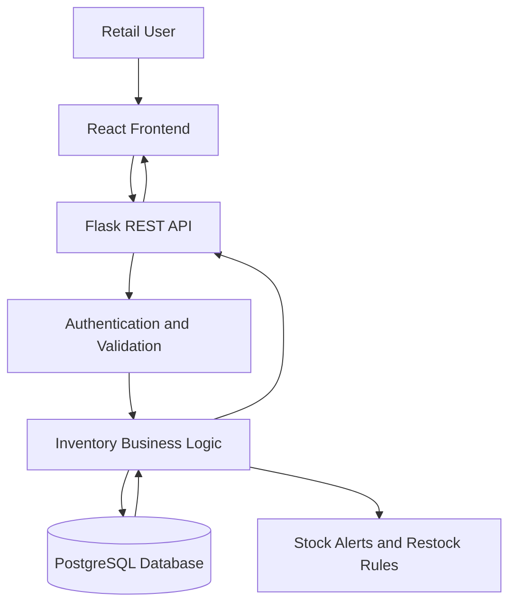
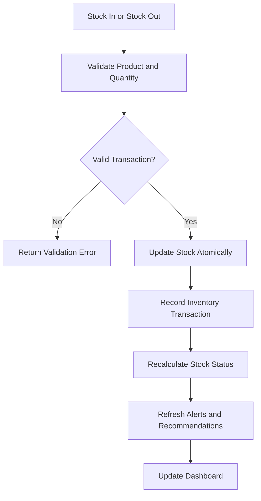
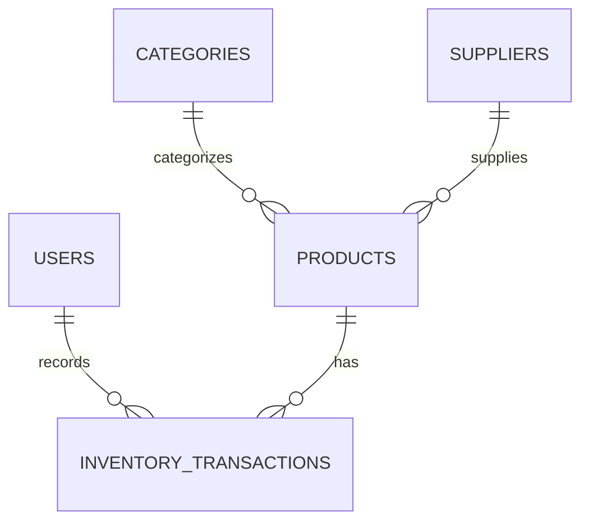
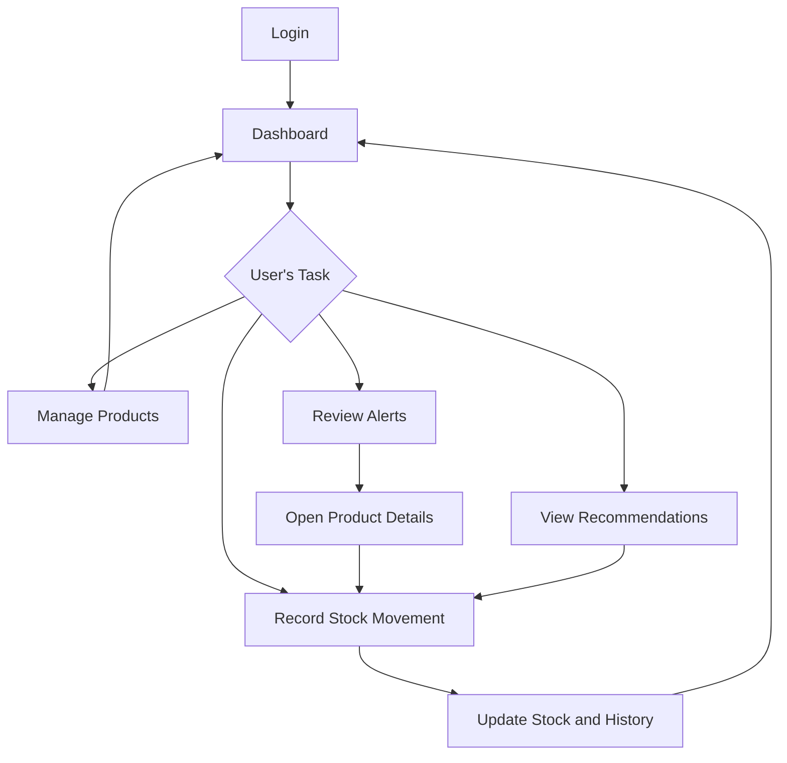

# 🚀 Day 2 — 10-Day Capstone

## 🏗️ System Design: Optimised Retail Inventory System

## 🎯 Today's Objective

Transform the product concept into a complete technical blueprint that makes implementation straightforward.

Today's focus is on system architecture, database design, API contracts, UI flows, and project structure — **without writing production code**.

## 📦 Project Overview

The **Optimised Retail Inventory System** is designed to help small and medium-sized retailers manage products, track stock movements, identify inventory risks, and make better restocking decisions.

The main goal is to move beyond basic inventory tracking and provide actionable insights into stock health.

## 1. 🛠️ Technology Stack

The final stack must be confirmed before implementation begins.

- **Frontend:** React.js with Vite
- **Styling:** HTML5, CSS3, and responsive layouts
- **Backend:** Python with Flask
- **Database:** PostgreSQL
- **Database Integration:** SQLAlchemy
- **API Communication:** REST API with JSON
- **Authentication:** JWT-based authentication if user accounts are required by the approved requirements
- **Version Control:** Git and GitHub
- **Deployment:** Free-tier hosting options, subject to current availability and limitations
- **AI Integration:** Not required for v1.0; use explainable rule-based inventory recommendations

### Why This Stack?

- React supports reusable dashboard components.
- Vite provides a straightforward frontend development setup.
- Flask is lightweight and suitable for a focused REST API.
- PostgreSQL supports reliable relational inventory data.
- SQLAlchemy simplifies database operations.
- GitHub provides version control and project documentation.

No paid services are required for the initial development workflow.

## 2. 🏗️ System Architecture



### Request Lifecycle

1. The user performs an action in the frontend.
2. The frontend validates basic input.
3. The frontend sends an HTTP request to the backend API.
4. The backend validates the request and checks permissions.
5. The business logic performs the requested operation.
6. SQLAlchemy communicates with PostgreSQL.
7. The backend returns a structured JSON response.
8. The frontend updates the relevant screen.

### Inventory Movement Flow



**Important:** Stock changes and their corresponding history records must be committed in one database transaction. A failed transaction must not leave stock and history inconsistent.

## 3. 🗄️ Database Design

### Core Tables

#### Users

| Field | Purpose |
|---|---|
| id | Primary key |
| name | User's name |
| email | Unique login identifier |
| password_hash | Securely hashed password |
| role | User role |
| created_at | Account creation timestamp |

#### Categories

| Field | Purpose |
|---|---|
| id | Primary key |
| name | Category name |
| description | Optional description |

#### Suppliers

| Field | Purpose |
|---|---|
| id | Primary key |
| name | Supplier name |
| contact_email | Optional email |
| phone | Optional contact number |
| created_at | Creation timestamp |

#### Products

| Field | Purpose |
|---|---|
| id | Primary key |
| name | Product name |
| sku | Unique stock-keeping unit |
| category_id | Foreign key to Categories |
| supplier_id | Optional foreign key to Suppliers |
| cost_price | Purchase cost |
| selling_price | Selling price |
| current_stock | Current available quantity |
| minimum_stock | Low-stock threshold |
| maximum_stock | Overstock threshold |
| is_active | Product availability |
| created_at | Creation timestamp |
| updated_at | Last update timestamp |

#### Inventory Transactions

| Field | Purpose |
|---|---|
| id | Primary key |
| product_id | Foreign key to Products |
| user_id | User who recorded the movement |
| transaction_type | STOCK_IN or STOCK_OUT |
| quantity | Positive movement quantity |
| previous_stock | Quantity before movement |
| updated_stock | Quantity after movement |
| reason | Optional movement reason |
| created_at | Transaction timestamp |

### Relationships



### Database Constraints

- SKU must be unique.
- Product names cannot be empty.
- Prices cannot be negative.
- Stock quantities cannot be negative.
- Transaction quantities must be greater than zero.
- Minimum stock must be non-negative.
- Maximum stock must not be lower than minimum stock.
- Foreign keys must reference valid records.
- Stock movements must be recorded consistently with stock updates.

## 4. 🔌 API Design

All endpoints use the `/api` prefix and return JSON.

### Authentication

| Method | Endpoint | Purpose |
|---|---|---|
| POST | `/api/auth/login` | Authenticate a user |
| POST | `/api/auth/register` | Register a user, if enabled for v1.0 |
| GET | `/api/auth/me` | Retrieve the current user's profile |

### Products

| Method | Endpoint | Purpose |
|---|---|---|
| GET | `/api/products` | List products with search and filters |
| POST | `/api/products` | Create a product |
| GET | `/api/products/:id` | Retrieve product details |
| PUT | `/api/products/:id` | Update product details |
| DELETE | `/api/products/:id` | Deactivate or delete a product safely |

### Categories

| Method | Endpoint | Purpose |
|---|---|---|
| GET | `/api/categories` | List categories |
| POST | `/api/categories` | Create a category |
| PUT | `/api/categories/:id` | Update a category |
| DELETE | `/api/categories/:id` | Delete an unused category |

### Suppliers

| Method | Endpoint | Purpose |
|---|---|---|
| GET | `/api/suppliers` | List suppliers |
| POST | `/api/suppliers` | Create a supplier |
| PUT | `/api/suppliers/:id` | Update supplier details |
| DELETE | `/api/suppliers/:id` | Delete an unused supplier |

### Inventory

| Method | Endpoint | Purpose |
|---|---|---|
| POST | `/api/inventory/stock-in` | Record incoming stock |
| POST | `/api/inventory/stock-out` | Record outgoing stock |
| GET | `/api/inventory/history` | Retrieve stock movement history |
| GET | `/api/inventory/alerts` | Retrieve low-stock, out-of-stock, and overstock alerts |
| GET | `/api/inventory/recommendations` | Retrieve restocking recommendations |

### Dashboard

| Method | Endpoint | Purpose |
|---|---|---|
| GET | `/api/dashboard/summary` | Retrieve inventory KPIs |
| GET | `/api/dashboard/analytics` | Retrieve category and stock analytics |

### API Validation Rules

- Required fields must be present.
- Quantities must be positive integers.
- Stock-out requests cannot exceed available stock.
- Product SKUs must be unique.
- Referenced products must exist and be active.
- Invalid identifiers must return an appropriate error.
- Unauthorized requests must be rejected.
- Database errors must not expose secrets or internal stack traces.

### Standard Error Responses

```json
{
  "success": false,
  "message": "Insufficient stock available",
  "error": {
    "code": "INSUFFICIENT_STOCK"
  }
}
```

Expected HTTP status codes include:

- `200` — Successful request
- `201` — Resource created
- `400` — Invalid request
- `401` — Authentication required
- `403` — Permission denied
- `404` — Resource not found
- `409` — Conflict, such as duplicate SKU
- `422` — Validation failure
- `500` — Unexpected server error

## 5. 🖥️ UI & User Flow

### Main Navigation

```text
Dashboard
├── Products
│   ├── Product List
│   ├── Add Product
│   ├── Edit Product
│   └── Product Details
├── Inventory
│   ├── Stock In
│   ├── Stock Out
│   └── Inventory History
├── Alerts
│   ├── Low Stock
│   ├── Out of Stock
│   └── Overstock
├── Recommendations
└── Settings
```

### User Flow



### Low-Fidelity Wireframe: Dashboard

```text
+------------------------------------------------------+
| Optimised Retail Inventory       Search     Profile  |
+------------------+-----------------------------------+
| Dashboard        | Inventory Overview                |
| Products         |                                   |
| Inventory        | [Products] [Stock Units]          |
| Alerts           | [Inventory Value] [Low Stock]     |
| Recommendations  |                                   |
| Settings         | [Inventory Health Chart]          |
|                  |                                   |
|                  | Low-Stock Products                |
|                  | Product | Current | Minimum       |
|                  |                                   |
|                  | Recent Inventory Activity          |
+------------------+-----------------------------------+
```

### Low-Fidelity Wireframe: Product List

```text
+------------------------------------------------------+
| Products                              [+ Add Product] |
+------------------------------------------------------+
| Search by name or SKU       Category      Stock Status|
+------------------------------------------------------+
| Product | SKU | Stock | Min | Price | Status | Action|
|------------------------------------------------------|
| Item A  | A01 |  12   | 15  | 500   | Low    | Edit  |
| Item B  | B02 |  40   | 10  | 250   | Normal | Edit  |
+------------------------------------------------------+
|                    Pagination                        |
+------------------------------------------------------+
```

### Low-Fidelity Wireframe: Stock Movement

```text
+---------------------------------------------+
| Record Stock Movement                       |
+---------------------------------------------+
| Movement Type: [Stock In / Stock Out]       |
| Product:       [Select Product]             |
| Quantity:      [Enter Quantity]             |
| Reason:        [Optional Reference]         |
| Current Stock: 25                            |
| Expected Stock: 35                           |
|                                             |
|             [Cancel] [Confirm Movement]     |
+---------------------------------------------+
```

## 6. 📁 Project Structure

```text
optimised-retail-inventory-system/
├── frontend/
│   ├── public/
│   ├── src/
│   │   ├── assets/
│   │   ├── components/
│   │   ├── layouts/
│   │   ├── pages/
│   │   ├── services/
│   │   ├── hooks/
│   │   ├── context/
│   │   └── utils/
│   ├── package.json
│   └── .env.example
├── backend/
│   ├── app/
│   │   ├── models/
│   │   ├── routes/
│   │   ├── controllers/
│   │   ├── services/
│   │   ├── schemas/
│   │   ├── utils/
│   │   └── config/
│   ├── tests/
│   ├── requirements.txt
│   └── .env.example
├── database/
│   └── README.md
├── docs/
│   ├── ARCHITECTURE.md
│   ├── SCHEMA.md
│   ├── API.md
│   ├── UI-WIREFRAMES.md
│   └── PROJECT-STRUCTURE.md
├── .gitignore
└── README.md
```

### Folder Responsibilities

- `frontend/src/components/` — Reusable UI components.
- `frontend/src/pages/` — Dashboard, product, inventory, alert, and recommendation screens.
- `frontend/src/services/` — API client and endpoint functions.
- `frontend/src/context/` — Shared authentication or application state, if needed.
- `backend/app/models/` — Database models.
- `backend/app/routes/` — API route definitions.
- `backend/app/controllers/` — Request and response handling.
- `backend/app/services/` — Inventory business rules and transactional operations.
- `backend/app/schemas/` — Request validation and response serialization.
- `backend/tests/` — Backend tests.
- `database/` — Database setup notes and seed-data documentation.
- `docs/` — System design and implementation documentation.

## 7. 🛡️ Scope Protection

The v1.0 focuses on:

**Products → Stock Movements → Inventory History → Alerts → Recommendations → Dashboard**

Features intentionally excluded:

- Multi-store management
- Advanced warehouse management
- Accounting integration
- Payment processing
- Barcode hardware integration
- Dedicated mobile application
- Predictive ML forecasting
- Complex supplier portals
- Full ERP functionality

## 8. 🧪 Day 3 Readiness Checklist

- [ ] GitHub repository exists and is cloned locally.
- [ ] Technology stack is confirmed.
- [ ] Architecture and request lifecycle are documented.
- [ ] Database schema supports the core user workflows.
- [ ] Stock movement logic preserves data consistency.
- [ ] API endpoints have documented contracts.
- [ ] UI screens and navigation are defined.
- [ ] Project structure is ready.
- [ ] Scope remains achievable within the capstone.
- [ ] Documentation is committed and pushed to GitHub.
- [ ] Project log is updated.

## 📸 Screenshots to Capture

- GitHub repository
- Project folder structure
- Architecture diagram
- Database schema or ER diagram
- API documentation
- UI wireframes
- Day 2 commit on GitHub

## ➡️ Handoff to Day 3

Day 3 will focus on project setup and environment configuration.

The next session should use the approved Day 2 design documents as the source of truth and proceed with:

1. Repository verification
2. Dependency and environment setup
3. Database configuration
4. Backend foundation
5. Frontend foundation
6. Initial local smoke tests

Do not restart product discovery or redesign the architecture unless a critical blocker is found.

## 💡 Key Learning

System design translates product requirements into architecture, data models, API contracts, and user flows before implementation begins.

## 🎯 Biggest Takeaway

> **Good system design turns a product idea into a buildable plan, so implementation becomes execution instead of constant redesign.** 🚀

## 📊 Day 2 Status

**System Design 🚧 | 2/10 Days**
